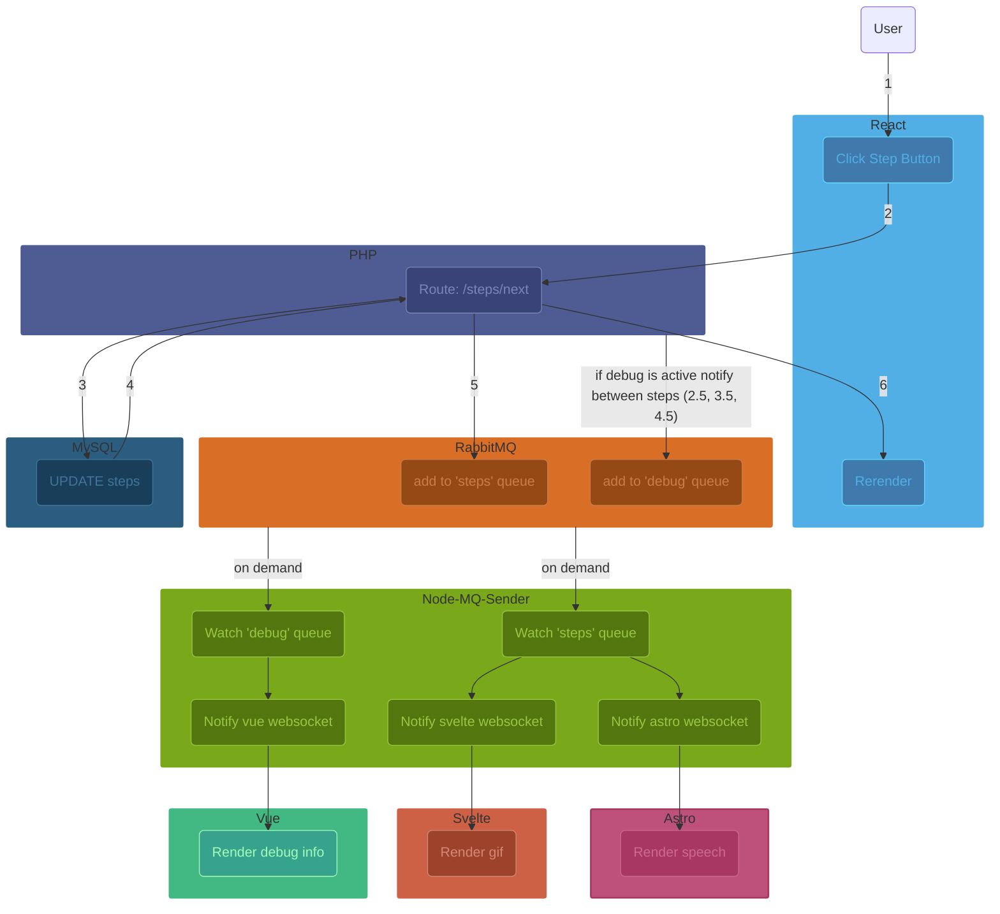

# rube-goldberg-hello-world
A hello world with the rube goldberg machine philosophy

Architecture:

```mermaid
flowchart TB
    subgraph React
        style React fill:#51afe6,stroke:#51afe6,stroke-width:2px, rx: 2,ry:2
        direction TB
        id1(Click Step Button)
        id6(Rerender)
        style id1 fill:#4079ab,stroke:#61DAFB,stroke-width:1px,color:#51afe6
        style id6 fill:#4079ab,stroke:#61DAFB,stroke-width:1px,color:#51afe6
    end    
    subgraph PHP
        style PHP fill:#4F5B93,stroke:#4F5B93,stroke-width:2px, rx: 2,ry:2
        direction TB
        id2(Route: /steps/next)
        style id2 fill:#394375,stroke:#7A86B8,stroke-width:1px,color:#7A86B8
    end
    subgraph RabbitMQ
        style RabbitMQ fill:#d96e26,stroke:#d96e26,stroke-width:2px, rx: 2,ry:2
        direction TB
        id4(add to 'steps' queue)
        style id4 fill:#954915,stroke:#cb7d48,stroke-width:1px,color:#cb7d48
        id12(add to 'debug' queue)
        style id12 fill:#954915,stroke:#cb7d48,stroke-width:1px,color:#cb7d48
    end
    subgraph MySQL
        style MySQL fill:#2b5d80,stroke:#2b5d80,stroke-width:2px, rx: 2,ry:2
        direction TB
        id3(UPDATE steps)
        style id3 fill:#183e59,stroke:#427599,stroke-width:1px,color:#427599
    end
    subgraph Node-MQ-Sender
        style Node-MQ-Sender fill:#79a81a,stroke:#79a81a,stroke-width:2px, rx: 2,ry:2
        direction TB
        id7(Watch 'steps' queue)
        style id7 fill:#53760e,stroke:#9ac645,stroke-width:1px,color:#9ac645
        id8(Notify astro websocket)
        style id8 fill:#53760e,stroke:#9ac645,stroke-width:1px,color:#9ac645
        id9(Notify svelte websocket)
        style id9 fill:#53760e,stroke:#9ac645,stroke-width:1px,color:#9ac645
        id13(Watch 'debug' queue)
        style id13 fill:#53760e,stroke:#9ac645,stroke-width:1px,color:#9ac645
        id14(Notify vue websocket)
        style id14 fill:#53760e,stroke:#9ac645,stroke-width:1px,color:#9ac645
    end
    subgraph Astro
    style Astro fill:#bd517a,stroke:#a83762,stroke-width:2px, rx: 2,ry:2
    direction TB
    id10(Render speech)
    style id10 fill:#a83762,stroke:#cb6a8f,stroke-width:1px,color:#cb6a8f
    end
    subgraph Svelte
    style Svelte fill:#cc6146,stroke:#cc6146,stroke-width:2px, rx: 2,ry:2
    direction TB
    id11(Render gif)
    style id11 fill:#9d432c,stroke:#d48875,stroke-width:1px,color:#d48875
    end
    subgraph Vue
    style Vue fill:#42B883,stroke:#42B883,stroke-width:2px, rx: 2,ry:2
    direction TB
    id15(Render debug info)
    style id15 fill:#37a38c,stroke:#A2FDBA,stroke-width:1px,color:#A2FDBA
    end
    id0(User)-- 1 -->id1
    id1-- 2 -->id2
    id2-- 3 -->id3
    id3-- 4 -->id2
    id2-- 5 -->id4
    id2-- 6 -->id6
    PHP-- if debug is active notify between steps (2.5, 3.5, 4.5) -->id12
    RabbitMQ-- on demand --> id7
    RabbitMQ-- on demand --> id13
    id7-->id8
    id7-->id9
    id8-->id10
    id9-->id11
    id13-->id14
    id14-->id15
```
